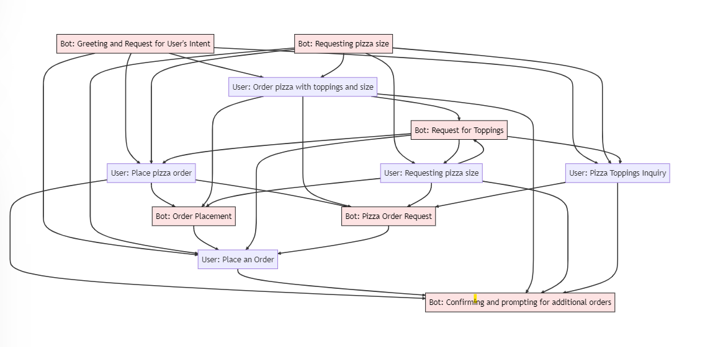

# Dialogue Schema Induction: An Unsupervised Approach

## About
This repository contains my research work on "Dialogue Schema Induction: An Unsupervised Approach." This research focuses on the automation of dialog schemas from domain-specific conversations using an unsupervised method. This advancement paves the way for the development of dialogue systems that are more comprehensive, versatile, and controllable.

## Highlights
- Developed an end-to-end pipeline for unsupervised dialog schema induction from domain-specific conversations.
- Leveraged BERT-based sentence transformer method for generating embeddings of utterances.
- Utilized Agglomerative Clustering from sklearn for clustering similar utterances.
- Employed GPT-3 language model for high-level dialogue action recognition.
- Optimized cluster merging using spacy lemmatizer and cosine similarity to improve coherence of the resulting dialogue schema.
- Derived dialog schemas using heuristics like transition probability.
- Successfully experimented with the MetaWoZ dataset, demonstrating the efficacy of the approach.

An example of a schema for the ordering a pizza domain:
. 

## Technical Skills
- Natural Language Processing
- Unsupervised Machine Learning
- Dialogue Systems
- BERT-based sentence transformer
- GPT-3 Language Model
- Python
- Spacy
- PyTorch
- Sklearn

## Project Structure
This research work is organized into the following sections:
- Finding embeddings for utterances
- Clustering the utterances
- Labeling the clusters
- Merging the clusters
- Using heuristics to find the schema for clusters

## Quick Start
Please refer to the `src` directory for the source code, and the `data` directory for the dataset used in this research. 

To replicate the research findings, follow these steps:
1. Clone the repository
2. Install the necessary dependencies (mentioned in `requirements.txt`)
3. Run the code 
`python main.py`

## Contributions
- Introduced a new approach for automatically constructing dialog schemas in an unsupervised manner from domain-specific conversations.
- Successfully categorized and labeled conversational utterances using a multi-phase framework, thereby identifying the distinct dialog actions that serve as nodes in a graph-based schema.
- Achieved promising results on the MetaWoZ dataset with the approach.

## Future Work
- Extending the schema induction approach to open-domain conversations.
- Exploring new strategies for schema induction.

## About Me
I am a motivated individual with a knack for problem-solving and the ability to independently manage project pipelines. I possess strong skills in programming, which I have applied to my research in the field of Dialogue Systems. My goal is to continually innovate and contribute to the development of emerging technologies. I am currently open to full-time Software Engineer roles where I can apply my technical expertise to challenging and impactful real-world problems. 

For any further queries or discussions related to my research work, feel free to reach out to me at stutia3@illinois.edu.

